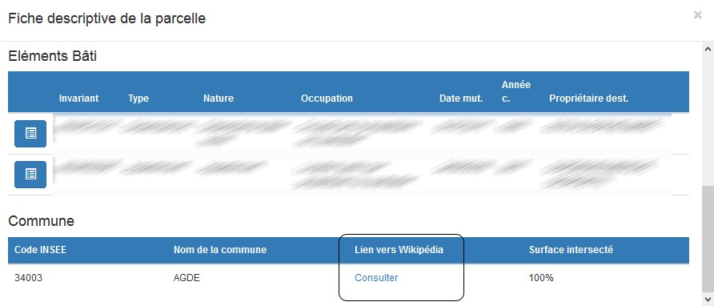

# Configuration du Cadastre

L'administration du module cadastre se fait directement sur le serveur en modifiant le fichier de properties
```
vmap/vas/rest/conf/cadastreV2/properties.inc
```
Sur ce fichier on trouve un script PHP contenant un tableau de propriétés défini par la variable **$properties** grâce auquel il est possible de gérer les paramètres suivants.

## Propriétés potentiellement modifiables

### Fiche descriptive de la parcelle

Properties génériques pour obtenir des informations sur les intersections.
Fonctionne avec des objets ponctuels (POINT), linéaires (LINE) et polygones (POLYGON).
Fonctionne avec une ou plusieurs vues et/ou une ou plusieurs tables.

**Exemple :**
- $properties["cadastre"]["descr_parcel"]["intersect"]["views"]["nom_vue"]["title"] = "Le titre"
- $properties["cadastre"]["descr_parcel"]["intersect"]["views"]["nom_vue"]["type"]= "POLYGON"
- $properties["cadastre"]["descr_parcel"]["intersect"]["views"]["nom_vue"]["intersect"] = "Libellé surface inter."
- $properties["cadastre"]["descr_parcel"]["intersect"]["views"]["nom_vue"]["champ1"] = "Libellé champ"
- $properties["cadastre"]["descr_parcel"]["intersect"]["views"]["nom_vue"]["champ2"] = "Libellé champ"
- $properties["cadastre"]["descr_parcel"]["intersect"]["views"]["nom_vue"]["..."] = "Libellé champ"

- $properties["cadastre"]["descr_parcel"]["intersect"]["views"]["..."]["title"] = "Le titre"
- etc...

Si ces informations sont mal renseignées, la fiche descriptive d'une parcelle peut ne pas se générer correctement.

**Exemple de personnalisation d'une intersection comprenant un lien href :**

1- Construction du lien dans une vue de postgresql

<!--Pour réaliser un lien dans les intersections il est indispensable de construire, dans une vue, le lien sous la forme '[link href="URL" target="\_blank"]Libellé[/link]' as "link"-->

L'affichage d'un lien dans les intersections se construit dans une vue de postgresql sous la forme '[link href="URL" target="\_blank"]Libellé[/link]' as "link"


Exemple :

```
SELECT commune.nom, ('[link href="https://fr.wikipedia.org/wiki/'::text || lower(commune.nom::text)) || '" target="_blank"]Consulter[/link]'::text AS link FROM sig.commune;
```

2- Affichage du lien dans les intersections

Une fois le lien construit dans la vue, ajouter une properties dans le fichier "."\vas\rest\conf\cadastreV2\properties.inc"

Exemple :
```
$properties["cadastre"]["descr_parcel"]["intersect"]["views"]["nom_schema.nom_vue"]["id_com"] = "Code INSEE"
$properties["cadastre"]["descr_parcel"]["intersect"]["views"]["nom_schema.nom_vue"]["nom"] = "Nom de la commne"
$properties["cadastre"]["descr_parcel"]["intersect"]["views"]["nom_schema.nom_vue"]["link"] = "Lien vers Wikipédia"
$properties["cadastre"]["descr_parcel"]["intersect"]["views"]["nom_schema.nom_vue"]["intersect"] = "Surface intersecté";
```
Le rendu suivant est obtenu :




#### cadastre.descr_parcel.intersect.tolerance
Surface minimum à partir de laquelle une intersection est prise en compte (en %).


### Fiche d'urbanisme

Properties génériques pour obtenir des informations sur les intersections.
Fonctionne avec des objets ponctuels (POINT), linéaires (LINE) et polygones (POLYGON).
Fonctionne avec une ou plusieurs vues et/ou une ou plusieurs tables.

Exemple :
- $properties["cadastre"]["fiche_urb"]["intersect"]["views"]["nom_vue"]["title"] = "Le titre"
- $properties["cadastre"]["fiche_urb"]["intersect"]["views"]["nom_vue"]["type"]= "POLYGON"
- $properties["cadastre"]["fiche_urb"]["intersect"]["views"]["nom_vue"]["intersect"] = "Libellé surface inter."
- $properties["cadastre"]["fiche_urb"]["intersect"]["views"]["nom_vue"]["champ1"] = "Libellé champ"
- $properties["cadastre"]["fiche_urb"]["intersect"]["views"]["nom_vue"]["champ2"] = "Libellé champ"
- $properties["cadastre"]["fiche_urb"]["intersect"]["views"]["nom_vue"]["..."] = "Libellé champ"

- $properties["cadastre"]["fiche_urb"]["intersect"]["views"]["..."]["title"] = "Le titre"
- etc...

Si ces informations sont mal renseignées, la fiche d'urbanisme d'une parcelle peut ne pas se générer correctement.

Il est aussi possible d'afficher ces informations sous forme de tableau de la manière suivante:
- $properties["cadastre"]["fiche_urb"]["intersect"]["array_views"][0]["nom_vue"]["..."] = "Libellé champ 1";
- $properties["cadastre"]["fiche_urb"]["intersect"]["array_views"][0]["nom_vue"]["..."] = "Libellé champ 2";
- $properties["cadastre"]["fiche_urb"]["intersect"]["array_views"][0]["nom_vue"]["..."] = "Libellé champ 3";
- $properties["cadastre"]["fiche_urb"]["intersect"]["array_views"][1]["nom_vue 2"]["..."] = "Libellé champ 1";
- $properties["cadastre"]["fiche_urb"]["intersect"]["array_views"][1]["nom_vue 2"]["..."] = "Libellé champ 2";
- $properties["cadastre"]["fiche_urb"]["intersect"]["array_views"][1]["nom_vue 2"]["..."] = "Libellé champ 3";
- $properties["cadastre"]["fiche_urb"]["intersect"]["array_views"][2]["nom_vue 3"]["..."] = "Libellé champ 1";
- $properties["cadastre"]["fiche_urb"]["intersect"]["array_views"][2]["nom_vue 3"]["..."] = "Libellé champ 2";
- $properties["cadastre"]["fiche_urb"]["intersect"]["array_views"][2]["nom_vue 3"]["..."] = "Libellé champ 3";

#### cadastre.fiche_urb.intersect.tolerance
Surface minimum à partir de laquelle une intersection est prise en compte (en %).

#### cadastre.fiche_urb.logo
Logo en base64 à afficher dans la fiche d'urbanisme

#### cadastre.fiche_urb.company
Nom du gestionnaire à afficher si il n'y a pas de logo

#### cadastre.fiche_urb.printtemplate_id
Identifiant du modèle d'impression à utiliser
Par défaut vaut -1

#### cadastre.fiche_urb.map_id
Identifiant de la carte à utiliser
Par défaut vaut -1

#### cadastre.fiche_urb.features_zoom
Pourcentage de zoom en fonction de la parcelle à utiliser
Par défaut vaut 800


## Propriétés à ne pas modifier

### cadastre.selection_limit
Limite de sélection d'objets sur la carte.
Par défaut vaut 100

### cadastre.rp.rp_dir
Endroit où stocker les rapports générés
Par défaut vaut $properties['vas_home'] . '/public/cadastreV2'

### cadastre.rp.rp_url
Lien vers les rapports générés
Par défaut vaut $properties['public_alias'] . '/cadastreV2'

### cadastre.rp.login
Login de l'utilisateur utilisé pour générer les rapports
Par défaut vaut u_vitis

### cadastre.rp.pass
Mot de passe de l'utilisateur utilisé pour générer les rapports
Par défaut est vide

### cadastre.selection_buffer
Buffer de sélection cartographique
Par défaut vaut 5

### cadastre.database_projection
Projection de la base de données
Par défaut vaut "EPSG:2154"

### cadastre.views.adresse
Vue utilisée pour l'objet adresse
Par défaut vaut "v_vmap_nb_10_parcelle_light"

### cadastre.views.commune
Vue utilisée pour l'objet commune
Par défaut vaut "v_vmap_commune"

### cadastre.views.description_parcelle
Vue utilisée pour l'objet description parcelle
Par défaut vaut "v_vmap_nb_10_parcelle"

### cadastre.views.invariant
Vue utilisée pour l'objet invariant
Par défaut vaut "v_vmap_bati_0010_local"

### cadastre.views.lieu_dit
Vue utilisée pour l'objet lieu dit
Par défaut vaut "v_vmap_lieu_dit"

### cadastre.views.parcelle
Vue utilisée pour l'objet parcelle
Par défaut vaut "v_vmap_parcelle_all_geom"

### cadastre.views.proprietaire
Vue utilisée pour l'objet propriétaire
Par défaut vaut "v_vmap_maj_pc"

### cadastre.views.section
Vue utilisée pour l'objet section
Par défaut vaut "v_vmap_section_cadastrale"

### cadastre.views.voie
Vue utilisée pour l'objet voie
Par défaut vaut "v_vmap_maj_fv"

### cadastre.view.bati
Vue utilisée pour l'objet bâti
Par défaut vaut "s_cadastre.v_vmap_batiment"
