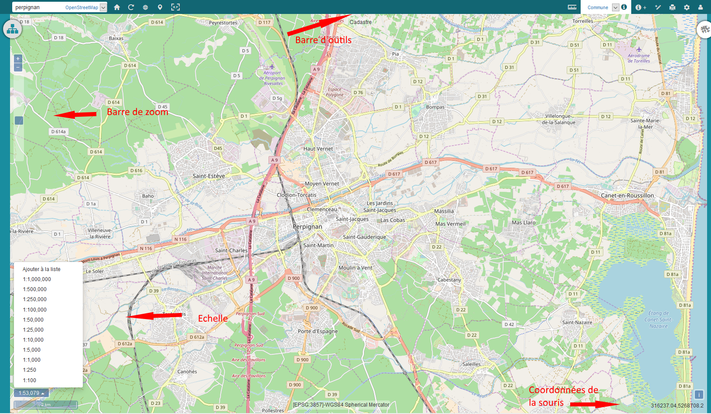

# Mode cartographie

## 1. Définition

Le mode visualisation cartographique, accessible aux utilisateurs en
ayant droits (vmap_user) permet l'affichage des cartes. La liste des
cartes disponibles pour l'utilisateur connecté dépend des groupes
auxquels il appartient.

## 2. La gestion des cartes

Le bouton Carte  permet de déployer :
- la table des matières
- la légende
- les jeux de données affichés sur la carte en cours
- le Gestionnaire des cartes. Le gestionnaire de cartes permet de sélectionner la carte à afficher et d'y opérer des opérations d'ajout de couches à la volée. Les couches peuvent être issues de service ou de fichier local.

L'ajout de couches dépend des services sélectionnés. L'ajout de l'url du service permet un ajout à la volée de la couche sur la carte en cours.
Il est possible d'ajouter des fichiers locaux au format  :

- KML
- TopoJSON
- IGC
- GeoJSON
- GPX

Le nom de la couche est facultatif. C'est le nom affiché dans le jeu de données et la table des matières. Si aucun nom de couche n'est fourni, alors le nom du fichier et son extension sont affichés.

## 3. Volet carte : Outils d'affichage, de sélection, d'interrogation et de filtre

On retrouve dans la Fenêtre "Carte" l'ensemble des fonctionnalités
classiques d'un web SIG mais aussi plusieurs fonctionnalités propres à
vMap.

-   La barre de zoom sur le côté gauche (le zoom peut aussi être effectué via la souris)
-   L'échelle et l'overview en bas à gauche
-   Les coordonnées de la souris en bas à droite
-   Les listes des outils de contrôle en haut à droite . Les outils de
    contrôle peuvent être activés ou désactivés à la volée par l'utilisateur
-   La liste des modèles d'impressions disponibles pour
    l'utilisateur connecté . L'ensemble des champs paramétrables pour les
    impressions sont définis, préalablement par l'administrateur, dans un modèle configuré.
-   Un outil d'insertion d'une donnée . Il donne accès au formulaire de création d'objet. Pour cela l'administrateur doit avoir préalablement paramétré un objet métier associé au calque de la donnée.
-   Un outil de sélection multiple  qui donne accès a 2 modes de recherche :
    - Une sélection graphique à partir des outils point, ligne, polygone et cercle
    - une sélection attributaire à partir d'un requêteur. Un objet métier doit obligatoirement avoir été associé au calque de la carte.

-   Un outil de sélection simple   permettant d'obtenir les informations attributaire d'un seul et unique objet sélectionné géographiquement. Pour cela, un objet métier doit obligatoirement être associé à un calque de la carte.

-   Un outil de mesure  qui permet le calcul de longueurs, superficies et mesures des géométries. Il permet l'export des mesures au format csv.
-   Un outil de localisation  à partir des coordonnées X et Y et d'un système de projection.
-   Un outil de géolocalisation  qui permet de centrer la carte sur la localisation de l'utilisateur en cours.
-   Un outil pour centrer la carte sur l'étendue maximale . L'étendue maximale d'une carte diffère en fonction du système de projection. Si la carte est en Lambert 93, l'étendue maximale de la carte est la France.
-   Un outil pour rafraichir les couches de la carte sans avoir à recharger l'application.
-   Un outil pour recentrer la carte sur l'emprise par défaut définie par l'administrateur.
-   Un outil de localisation par la saisie d'adresse. Par défaut l'outil fonctionne avec la couche Open Street Map. Si un objet métier est associé à un calque de la carte, un choix sera disponible entre plusieurs localisations.

## 4. Accès direct : visualisation d'objet spécifique
Il est possible de visualiser un objet spécifique d'une carte en indiquant dans l'url, les paramètres suivants séparés par des &.
Chacun de ces paramètres est facultatif

   - map_id: l'identifiant de la carte à afficher (récupérable dans la liste des cartes)
   - bo_id: identifiant de l'objet métier à interroger
   - ids: le ou les identifiants des entités à afficher (nécessite bo_id)
   - login: login pour une connexion automatique (nécessite password)
   - password: mot de passe pour une connexion automatique

 Un zoom est effectué sur l'objet défini en paramètre de l'url et ce dernier est centré sur la carte qui s'affiche.

 Exemple d'url :

 https://demo.veremes.net/vmap/?map_id=-1&bo_id=veremes_parcelles_visualisation&ids=66366000AB0003|66366000AB0007&login=demo&password=demo
