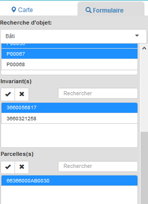
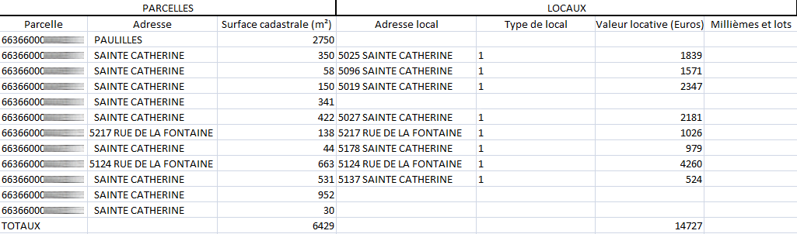
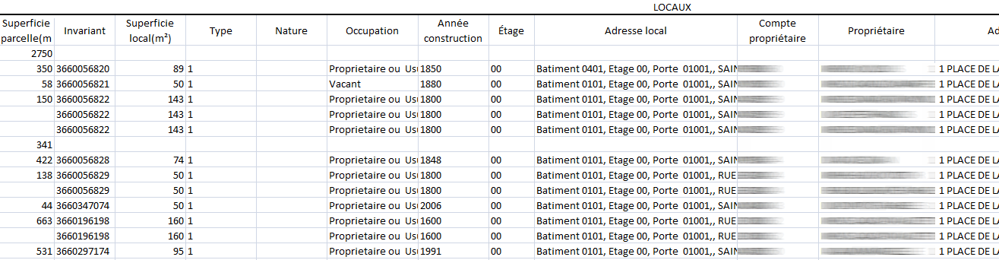

# Module cadastre

Le module Cadastre est un module spécifique à vMap intégré dans l'interface cartographique. Le but du module Cadastre est de rechercher soit cartographiquement soit de manière attributaire des entités cadastrales (parcelles, sections, bâtis etc..) pour les  visualiser, consulter leurs informations et générer des rapports spécifiques.

Le module Cadastre est accessible aux personnes en ayant droit, c'est à dire à tout utilisateur pour lequel l'administrateur de l'application a attribué les droits nécessaires pour accéder au module. [En savoir plus sur la gestion des utilisateurs et de leurs privilèges dans vMap](http://vmap.readthedocs.io/fr/latest/doc_module_vitis/administration/users.html).

Le bouton **module cadastre**   permet de déployer le module Cadastre à droite de la carte. Il comporte l'intégralité des fonctionnalités spécifiques à la recherche d'informations cadastrales de la carte Cadastre.

Le module Cadastre est composé des éléments suivants :

- L'onglet Carte permet la recherche graphique des composants du cadastre.
- L'onglet Formulaire permet la recherche attributaire des composants du cadastre.
- Le bloc "Utiliser la sélection" permet l'ajout et la suppression des éléments sélectionnés dans le panier, ainsi que la génération de rapports.

## 1. Recherche graphique : l'onglet Carte

L'onglet Carte du module Cadastre permet de sélectionner  des éléments du cadastre directement sur la carte  puis d'en générer un rapport.  Il existe deux façons de sélection d'objets et de génération de rapports :

### 1 - Le rapport en un clic
Relatif à la parcelle, le "rapport en un clic" permet  de générer des rapports parcelle par parcelle.
Une fois une parcelle sélectionnée, ses données littérales peuvent être affichées  par l'intermédiaire d'un panier   .

 Après avoir choisi le type de rapport à générer, l'opérateur clique dans la carte sur la parcelle dont il veut extraire les informations.

 3 types de rapports relatifs à une parcelle sélectionnée  peuvent être générés :  la fiche descriptive de la parcelle, le relevé de propriété et la fiche d’urbanisme

 #### Fiche descriptive de la parcelle.

 Cliquer sur le bouton Fiche descriptive , puis sélectionner sur la carte, la parcelle dont on souhaite extraire les informations cadastrales.

Les éléments constitutifs de la fiche descriptive d'une parcelle  sont préalablement configurés par l'administrateur de l'application vMap. [En savoir plus sur la configuration de la fiche descriptive d'une parcelle](http://vmap.readthedocs.io/fr/latest/doc_module_vmap/administration/module_cadastre.html#fiche-descriptive-de-la-parcelle)

La fiche descriptive fournit généralement les éléments suivants :  

- le numéro, la superficie et la commune d'appartenance de la parcelle
- la liste des propriétaires de la parcelle
- la liste  des subdivisions fiscales de la parcelle
- la liste des bâtis de la parcelle

 

Un bouton Impression  en bas de la fenêtre permet d'imprimer la fiche descriptive de la parcelle.

Les boutons    et   en haut à droite de la fenêtre, permettent de générer directement ces deux rapports sans passer par le module Cadastre.  

#### Le relevé de propriété

Cliquer sur le bouton Relevé de propriété , puis sélectionner la parcelle à interroger par un clic sur la carte.

3 types de relevés sont disponibles :

 

  - Relevé de propriété standard : génération au format pdf, du relevé de propriété de la parcelle.
  - Relevé de propriété tiers : génération au format pdf du relevé de propriétés tiers.
  - Relevé de propriété de la parcelle : génération au format pdf du relevé de propriété de la parcelle sélectionnée.

#### La fiche d'urbanisme

Cliquer sur le bouton Fiche d'urbanisme , puis cliquer sur la parcelle dont on souhaite extraire la fiche.

Les éléments constitutifs de la fiche d'urbanisme sont préalablement configurés par l'administrateur de l'application vMap. [En savoir plus sur la configuration de la fiche d'urbanisme d'une parcelle](http://vmap.readthedocs.io/fr/latest/doc_module_vmap/administration/module_cadastre.html#fiche-d-urbanisme).

Une fiche d'urbanisme est généralement constitutée des éléments suivants :

  - Titre et en-tête
  - Carte illustrant la parcelle sélectionnée dans sa commune d'appartenance
  - Descriptif de la parcelle (numéro de section, numéro de parcelle....)
  - Liste des propriétaires de la parcelles
  - ...

### 2- La recherche avancée

La recherche avancée permet de sélectionner sur la carte un objet puis d'en afficher ses données littérales par l'intermédiaire d'un panier   .

La recherche avancée s'opère en 2 temps :

#### 1. Sélection de l'objet à rechercher
La première étape consiste à sélectionner le type d'objet à requêter.
Cliquer sur l'un des objets suivants :

  - la commune
  - la section
  - le lieu dit
  - la parcelle
  - le bâtis

 Une fois sélectionné, le type d'objet à interroger apparait en blanc :

Dans l'exemple ci-dessus, l'opérateur effectue une recherche des éléments relatifs à la commune.

#### 2. Choix du mode de sélection graphique
La deuxième étape consiste à choisir la façon dont les objets de la carte seront sélectionnés.

Dans l'exemple ci-dessus, l'opérateur effectue une recherche de commune par point.

Cliquer sur l'un des modes de sélection suivants :

 - Par point : il s'agit du mode de sélection le plus simple puisqu'un seul objet est retourné. L'objet intersecté par le point (emplacement du clic) est sélectionné. Il apparaît en surbrillance sur la carte. Il peut désormais être ajouté au panier.

.

 - Par ligne : tous les objets intersectant la ligne dessinée à l'écran sont retournés.

     Un double clic permet de finaliser  le dessin de la ligne sur la carte.

 

 Dans l'exemple ci-dessus, la ligne déssinée intersecte 3 parcelles.

  

  Les 3 parcelles qui intersectent la ligne dessinée à l'écran apparaissent en surbrillance. Elles peuvent désormais être ajoutées au panier.

 - Par polygone : tous les objets compris et intersectés par le polygone dessiné à l'écran sont retournés.

    Un double clic permet de finaliser  le dessin du polygone.

  

   Dans l'exemple ci-dessus, le polygone dessiné intersecte 4 parcelles.

  

  Les 4 parcelles qui intersectent le polygone dessiné à l'écran apparaissent en surbrillance. Ils peuvent désormais être ajoutés au panier.

    Cocher l'option  pour que les éléments nouvellement sélectionnés soient ajoutés à la liste des éléments préalablement sélectionnés.

## 2. Recherche attributaire : l'onglet Formulaire

La recherche des objets du cadastre peut être effectuée à partir des données littérales sans passer par la carte et la sélection graphique. L'onglet Formulaire permet ce mode de recherche. 5 types de recherche sont disponible :  
  - La recherche de commune
  - La recherche de section(s)
  - la recherche de lieu(x) dit(s)
  - la recherche de parcelle(s)
  - la recherche de bâti(s)

 A chaque objet sélectionné, correspondent des critères de recherche différents.

### La recherche de commune

Après avoir indiqué la commune comme objet recherché, l'opérateur sélectionne dans la liste déroulante, la commune dont il veut extraire les données attributaires.

   

   Une fois sélectionnée la commune peut être ajoutée au panier.

### La recherche de section(s)

Après avoir indiqué la section comme objet recherché, l'opérateur sélectionne dans la liste déroulante, la commune de la section recherchée. Les sections s'affichent sous forme tabulaire. L'opérateur sélectionne la ou les sections dont il veut extraire les informations. Le bouton  permet de sélectionner toutes les sections du tableau. Le bouton  permet d'annuler la sélection des sections.

 

 Une fois sélectionnée(s), la sélection peut être ajoutée au panier.

### La recherche de Lieu(x) dit(s)

Après avoir indiqué le lieu dit  comme objet recherché, l'opérateur sélectionne dans la liste déroulante la commune du lieu dit. Les lieux dits s'affichent sous forme de liste. L'opérateur sélectionne le ou les lieux dits dont il veut extraire les informations. Le bouton  permet de sélectionnes toutes les lieux dits. Le bouton  permet d'annuler la sélection des lieux dits. Un formulaire   permet la saisie du nom ou d'une partie du nom d'un lieu dit pour en  filtrer la liste.

 

Une fois sélectionné(s), les lieux-dits peuvent être ajoutés au panier.

### La recherche de parcelle(s)

Après avoir indiqué la parcelle comme objet recherché, l'opérateur sélectionne dans la liste déroulante le critère de recherche désiré :

  - recherche de parcelle(s) par section
  - recherche de parcelle(s) par adresse DGFIP
  - recherche de parcelle(s) par propriétaire

#### La recherche de parcelles par section

L'opérateur sélectionne la commune puis la section d'appartenance de la parcelle. La liste des parcelles s'affichent sous forme tabulaire. L'opérateur sélectionne la ou les parcelles dont il veut extraire les informations. Le bouton  permet de sélectionnes toutes les parcelles. Le bouton  permet d'annuler la sélection des parcelles. Un formulaire   permet la saisie de la référence ou d'une partie de la référence de la parcelle pour en filtrer la liste.

 

Une fois sélectionnée(s), les parcelles peuvent être ajoutées au panier.

#### La recherche par adresse DGFIP
L'opérateur sélectionne la commune puis la voie d'appartenance de la parcelle. La liste des parcelles s'affichent sous forme tabulaire. L'opérateur sélectionne la ou les parcelles dont il veut extraire les informations. Un formulaire   permet la saisie du nom  ou d'une partie du nom de la voie pour en filtrer la liste.

La liste "Adresses" permet ensuite de sélectionner une ou toutes les adresses de la voie sélectionnée.

Une fois sélectionnée(s), la(es) parcelles(s) peut(vent) être ajoutée(s) au panier.

#### La recherche par propriétaire
L'opérateur sélectionne la commune puis le propriétaire de la parcelle. Un module de recherche permet de filtrer la lister des propriétaires en saisissant le nom ou une partie du nom du propriétaire.

  Il faut saisir un minimum de 3 caractères pour que le module de recherche puisse fonctionner.

 

La liste des propriétaires de la commune s'affiche. L'opérateur sélectionne ensuite le ou les comptes du propriétaire sélectionné. Le bouton  permet de sélectionnes toutes les comptes. Le bouton  permet d'annuler la sélection des comptes. Un formulaire   permet la saisie de la référence ou d'une partie de la référence du compte  pour en filtrer la liste.

 

 L'opérateur sélectionne ensuite la liste des parcelles du ou des comptes sélectionnés.

  

  Le bouton  permet de sélectionnes toutes les parcelles. Le bouton  permet d'annuler la sélection des parcelles. Un formulaire   permet la saisie de la référence ou d'une partie de la référence de la parcelle pour en filtrer la liste.

Une fois sélectionnée(s), la(es) parcelles(s) peut(vent) être ajoutée(s) au panier.

#### La recherche par bâti
L'opérateur sélectionne la commune puis le propriétaire de la parcelle. Un module de recherche permet de filtrer la lister des propriétaires en saisissant le nom ou une partie du nom du propriétaire.

  Il faut saisir un minimum de 3 caractères pour que le module de recherche puisse fonctionner.

La liste des propriétaires de la commune s'affiche. L'opérateur sélectionne ensuite le ou les comptes du propriétaire sélectionné. Le bouton  permet de sélectionnes toutes les comptes. Le bouton  permet d'annuler la sélection des comptes. Un formulaire   permet la saisie de la référence ou d'une partie de la référence du compte  pour en filtrer la liste.

L'opérateur sélectionne ensuite dans la liste le  bâti associés au(x) compte(s) sélectionné(s). Il sélectionne ensuite les invariants, puis la parcelle dont il cherche à extraire les informations.  

 

Une fois sélectionnée(s), la(es) parcelles(s) peut(vent) être ajoutée(s) au panier.

## 3. Le bloc Utilisation de la sélection et le panier

Une fois un objet sélectionné, il peut être ajouté au panier et être utilisé pour générer un rapport lui étant propre.

### Ajouter une sélection au panier

Une fois les objets sélectionnés, cliquer sur le bouton   .

Le panier permet d'afficher, sous forme tabulaire, les objets sélectionnés graphiquement. L'intégralité des attributs des objets sont affichés.
Une fois qu'un élément sélectionné est ajouté au panier, il apparait dynamiquement dans le tableau. A chaque ajout au panier, le tableau est enrichi d'un enregistrement supplémentaire.

Un objet ajouté au panier apparaît en rouge et est centré sur la carte.

### Effacer la sélection

Le bouton **Effacer la sélection**   permet de désélectionner les objets préalablement sélectionnés.

### Vider le panier

Le bouton **Remplacer le panier**   permet de vider l'intégralité des objets stockés dans le panier.

### Localiser les éléments sélectionnés

Le bouton , uniquement accessible lorsque la recherche a été opérée via l'onglet Formulaire, permet d'afficher en surbrillance sur la carte, les éléments requêtés.
Le ou les objets sont centrés sur la carte et un zoom est effectué dessus.

### Naviguer dans le panier

- Afficher/désafficher le panier : cliquer sur le bandeau situé en haut du panier pour faire apparaître/disparaître le panier.

 

- Zoom sur une géométrie : le pictogramme Zoom sur la géométrie    permet de zoomer sur l'élément sélectionné. L'objet sélectionné est centré sur la carte est apparaît en surbrillance bleue. Le bouton  permet d'annuler la mise en surbrillance d'un objet.

- Tri des objets : un clic sur l'en-tête d'une colonne permet de trier les données par ordre croissant et décroissant.

- Onglets du panier : à chaque type d'objet sélectionné correspond un onglet dans le panier. Ainsi par exemple, si des communes et des parcelles ont été recherchées puis ajoutées au panier, alors deux onglets sont affichés dans le panier  : 

- Exporter les données attributaires : le bouton  en haut à droite du panier permet l'export de l'intégralité des attributs de tous les objets de l'onglet en cours d'affichage.
L'opérateur sélectionne le format destination dans lequel exporter les données attributaires :
    - EXCEL
    - JSON
    - CSV
    - XML
    - TXT

- Générer un rapport depuis le panier : le bouton  permet de générer un rapport directement à partir des éléments affichés dans le panier.
[En savoir plus les rapports](http://vmap.readthedocs.io/fr/latest/doc_module_vmap/utilisation/module_cadastre.html#la-generation-de-rapports).

 Le bouton **Remplacer le panier** vide l'intégralité des objets de tous les onglets du panier.

  Le panier est mis à jour à chaque fois qu'un objet est Ajouté au panier.  

## 4.  La génération de rapports
La dernière étape du processus d'interrogation des données cadastrales consiste à générer un rapport du ou des objets sélectionnés et ajoutés au panier.

Une fois un élement sélectionné puis ajouté au panier,  il est possile de générer un rapport en cliquant sur le bouton  .

Une fenêtre de génération de rapport s'ouvre. L'opérateur sélectionne dans le tableau les objets dont il souhaite extraire les données, puis il sélectionne le rapport de son choix.

Les objets qui apparaissent dans le tableau de la fenêtre sont les objets du panier.

   La génération de rapport de l'élément requêté  n'est possible que si l'administrateur de l'application en a préalablement conçu un, et s'il a  pris soin d'associer le rapport au type d'objet sélectionné.

  9 rapports relatifs aux parcelles sont livrés avec l'application vMap.

   - Fiche descriptive de la parcelle
   - Fiche d'urbanisme
   - Relevé de propriété de la parcelle
   - Emprise bâties/non bâties
   - Subdivisions fiscales
   - Locaux
   - Toutes les informations
   - Propriétaires
   - Propriétaires des locaux

  Certains rapports sont relatifs à une et une seule parcelle, alors que d'autres sont relatifs à plusieurs parcelles sélectionnées et ajoutées au panier.

  ### La Fiche descriptive de la parcelle

  La fiche descriptive de la parcelle retourne sous forme tabulaire la liste des propriétaires et des subdivisions fiscales de la parcelle sélectionnée. Elle est relative à une unique parcelle.

  Il s'agit de la même fiche descriptive retournée par [la recherche en un clic](http://vmap.readthedocs.io/fr/latest/doc_module_vmap/utilisation/module_cadastre.html#fiche-descriptive-de-la-parcelle)

La fiche descriptive de la parcelle est configurable par l'administrateur de l'application.
  [En savoir plus sur la configuration des rapports](http://vmap.readthedocs.io/fr/latest/doc_module_vmap/administration/module_cadastre.html).

### Le relevé de propriété de la parcelle

Ce rapport retourne au format PDF le relevé de propriété de la parcelle sélectionnée. Il est relatif à une unique parcelle. La fiche de relevé de propriété retourne le ou les propriétaires de la parcelle sélectionnée et en détaille le bâti et le non bâti.

Il s'agit du relevé de propriété stanadard généré par ["la recherche en un clic"](http://vmap.readthedocs.io/fr/latest/doc_module_vmap/utilisation/module_cadastre.html#le-releve-de-propriete)

### La fiche d'urbanisme

Relative à une unique parcelle, la fiche d'urbanisme  est associée à un modèle d'impression dont les éléments sont configurables par l'administrateur de vMap.
Il s'agit de la même fiche d'urbanisme générée par  ["le rapport en un clic"](http://vmap.readthedocs.io/fr/latest/doc_module_vmap/utilisation/module_cadastre.html#la-fiche-d-urbanisme)

### Emprises bâties/non bâties

Le rapport Emprises bâties/non bâties fournit un fichier Excel listant pour toutes les parcelles sélectionnées la surface en m² et en proportion du bâti et du non bâti les composant.

### Subdivisions fiscales

Le rapport Emprises bâties/non bâties fournit un fichier Excel listant pour toutes les parcelles sélectionnées le revenu fiscal, la surface et son occupation.

### Toutes les informations

Un rapport des parcelles sélectionnées est généré au format PDF. Il contient pour chaque parcelle l'intégralité des composants cadastraux : références de parcelle, propriétaires, subdivisons fiscales, emprise bâti/non bâti et locaux.

### Propriétaires

Un rapport au format Excel est généré. Il liste pour chaque parcelle sélectionnée, le compte propriétaire, son nom et adresse.

### Locaux

Un rapport au format Excel est généré. Il liste pour chaque parcelle sélectionnée, les informations fiscales des locaux les composants : adresse, type et valeur locative.

### Propriétaires des locaux

Un rapport Excel est généré. Il liste pour chaque parcelle sélectionnée, l'intégralité des informations fiscale des dont les comptes propriétaires, les descriptifs fiscaux des locaux, les types, natures et occupations...

